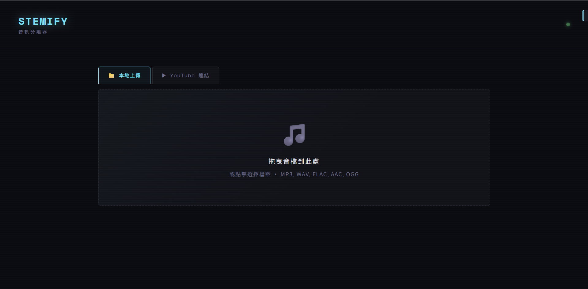
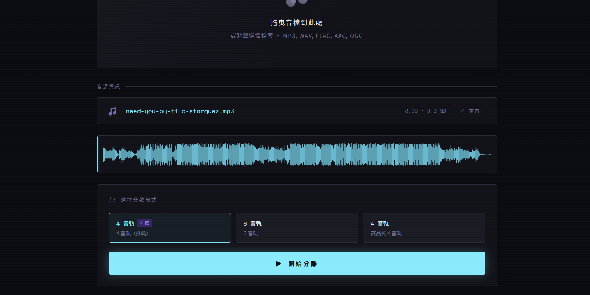
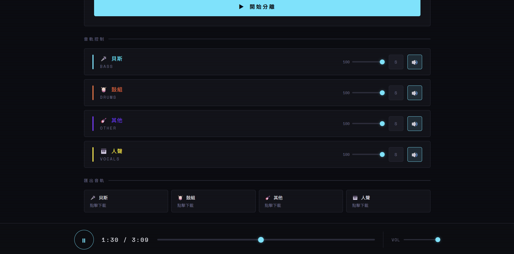

# 🎵 Stemify

> AI 音軌分離工具 — 將任何一首歌拆解成人聲、鼓組、貝斯、吉他等獨立音軌

[](https://www.python.org/)
[](https://fastapi.tiangolo.com/)
[](https://www.docker.com/)
[](https://github.com/facebookresearch/demucs)

**繁體中文 | [English](README.md)**

---

## 📸 Demo

**1. 上傳檔案或貼上 YouTube 連結**

<div align="center">
  
</div>

**2. 分離中 — AI 處理進行中**

<div align="center">
  
</div>

**3. 完成 — 播放並下載各音軌**

<div align="center">
  
</div>

---

## ✨ 功能特色

- 🎙️ **AI 音軌分離** — 由 Meta Research 的 Demucs 模型驅動，拆出人聲、鼓、貝斯、其他樂器
- 📁 **本地上傳** — 支援拖曳上傳，接受 MP3、WAV、FLAC、AAC、OGG、M4A 等格式
- 🎬 **YouTube 連結** — 直接貼上 YouTube 網址，自動下載並分離
- 🎚️ **互動式播放器** — 每條音軌獨立控制音量、靜音、Solo 模式，同步播放
- 📊 **波形視覺化** — Canvas 即時渲染波形，點擊任意位置跳轉
- 💾 **高品質下載** — 每條音軌可個別下載為 320kbps MP3
- 🐳 **一鍵啟動** — Docker Compose 容器化，無需手動安裝環境

---

## 🏗️ 技術架構

| 層級 | 技術 |
|------|------|
| Frontend | Vanilla JS (ES Modules)、CSS3、Web Audio API |
| Backend | FastAPI、Python 3.11、Uvicorn |
| AI 模型 | Demucs 4.0.1（Meta Research） |
| 音訊處理 | FFmpeg、yt-dlp、torchaudio |
| 容器化 | Docker、Docker Compose、Nginx Alpine |

---

## 🚀 快速開始（Docker）

### 前置需求

- 安裝 [Docker Desktop](https://www.docker.com/products/docker-desktop/)（Windows / macOS / Linux 皆適用）
- 確認 Docker Desktop 已啟動（右下角出現鯨魚圖示）
- 建議記憶體至少 **8 GB**，處理長音樂時建議 **12 GB 以上**

### 步驟

**1. Clone 專案**

```bash
git clone https://github.com/yoyozheng97w/stemify.git
cd stemify
```

**2. 啟動容器**

首次啟動（建置映像檔並下載 Demucs 模型，需要 **5～15 分鐘**）：

```bash
docker compose up --build
```

後續啟動（約 5 秒，所有資源皆已快取）：

```bash
docker compose up
```

> 等到終端出現 `Uvicorn running on http://0.0.0.0:8000` 即表示啟動完成。

**3. 開啟瀏覽器**

```
http://localhost:3000
```

**4. 停止容器**

```bash
docker compose down
```

### 注意事項

| 項目 | 說明 |
|------|------|
| 首次啟動時間 | 5～15 分鐘（需下載模型，約 300 MB） |
| 第二次之後 | 模型已快取，啟動約 5 秒 |
| 記憶體限制 | 預設上限 12 GB（可在 `docker-compose.yml` 調整） |
| 音樂處理時間 | 每首歌約 2～10 分鐘（依音樂長度和 CPU 效能而定） |

---

## 📖 使用方式

### 方法一：上傳本地檔案

1. 點選「上傳音樂」分頁
2. 將音樂檔拖曳進上傳區，或點擊選擇檔案
3. 選擇 AI 分離模型
4. 點擊「開始分離」
5. 等待處理完成後，即可播放或下載各音軌

### 方法二：YouTube 連結

1. 點選「YouTube」分頁
2. 貼上 YouTube 影片網址
3. 選擇 AI 分離模型
4. 點擊「開始分離」
5. 等待下載 + 處理完成，即可播放或下載各音軌

---

## 🤖 AI 模型比較

| 模型 | 音軌數 | 音軌內容 | 適用情境 | 處理速度 |
|------|--------|----------|----------|----------|
| `htdemucs` | 4 軌 | 人聲、鼓、貝斯、其他 | 一般用途，**推薦首選** | ⚡ 快 |
| `htdemucs_6s` | 6 軌 | 人聲、鼓、貝斯、吉他、鋼琴、其他 | 需要更細緻分離 | 🐢 較慢 |
| `mdx_extra` | 4 軌 | 人聲、鼓、貝斯、其他 | 另一種演算法，音質略有不同 | ⚡ 快 |

---

## 🔌 API 端點

後端預設運行於 `http://localhost:8000`

| Method | 端點 | 說明 |
|--------|------|------|
| `GET` | `/models` | 取得可用模型列表 |
| `POST` | `/separate` | 上傳音訊檔案並分離 |
| `POST` | `/separate-url` | 透過 YouTube URL 下載並分離 |
| `GET` | `/download/{model}/{track}/{filename}` | 下載指定音軌（支援 Range 請求） |
| `DELETE` | `/cleanup/{job_id}` | 清除指定工作的暫存檔 |

---

## ⚙️ 進階設定

編輯 `docker-compose.yml` 可調整以下參數：

```yaml
environment:
  - OMP_NUM_THREADS=8   # CPU 執行緒數，建議設為 CPU 核心數

deploy:
  resources:
    limits:
      memory: 12G       # 記憶體上限，記憶體較少可調低至 8G
```

